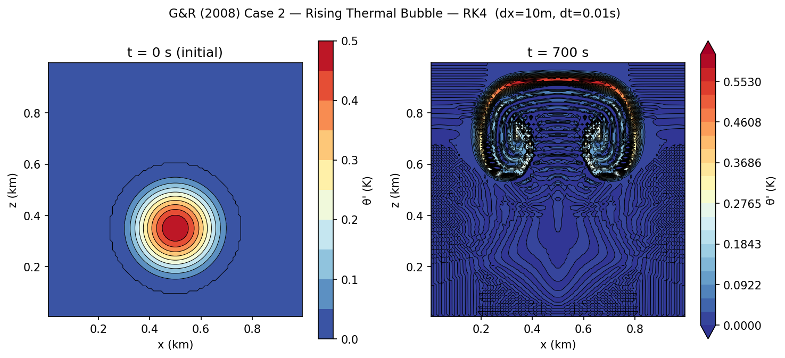
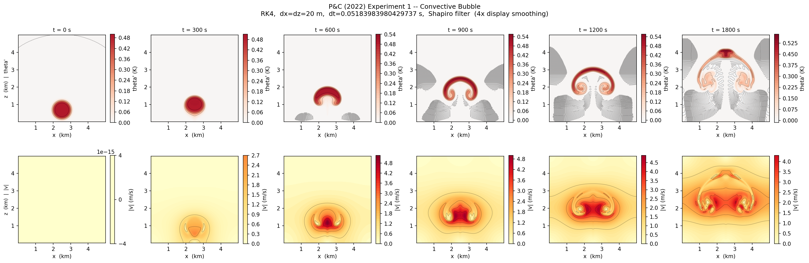

<div align="center">

# 2D Non-Hydrostatic Compressible Atmospheric Model

**MSc Dissertation — Data & Computational Science**

University College Dublin &nbsp;|&nbsp; ACM40910 &nbsp;|&nbsp; Supervisor: Dr Colm Clancy (UCD)


</div>

---

## Table of Contents

1. [Project Overview](#1-project-overview)
2. [Governing Equations](#2-governing-equations)
3. [Operator Splitting](#3-operator-splitting)
4. [Base State](#4-base-state)
5. [Numerical Discretisation](#5-numerical-discretisation)
6. [Time Integration Schemes](#6-time-integration-schemes)
7. [Stability Constraints](#7-stability-constraints)
8. [Numerical Diffusion and Filtering](#8-numerical-diffusion-and-filtering)
9. [Benchmark Test Cases](#9-benchmark-test-cases)
10. [Convergence Results](#10-convergence-results)
11. [Repository Structure](#11-repository-structure)
12. [Getting Started](#12-getting-started)
13. [Running the Experiments](#13-running-the-experiments)
14. [Development Status](#14-development-status)
15. [References](#15-references)

---

## 1. Project Overview

This repository implements a **2D non-hydrostatic compressible atmospheric model**
in Python. The scientific goal is a systematic comparison of the efficiency and
accuracy of four time integration schemes — classical Runge-Kutta, semi-implicit,
and exponential propagation iterative (EPI) methods — when applied to the
compressible Euler equations governing dry atmospheric convection.

The **novel contribution** is an efficiency frontier plot (error vs CPU time) that
directly compares these schemes on the same benchmark. Neither Robert (1993) nor
Pudykiewicz & Clancy (2022) provide this comparison.

The primary validation benchmark is the **rising thermal bubble** test case of
Giraldo & Restelli (2008, Case 2), chosen because it runs stably without explicit
diffusion, making it a clean platform for isolating temporal integration errors.

---

## 2. Governing Equations

The model solves the **compressible Euler equations in θ-π perturbation form** on a
2D vertical $(x, z)$ slice. Prognostic variables are split into a horizontally
uniform, time-invariant base state (overbar) and a perturbation (prime):

$$\theta = \bar{\theta}(z) + \theta'(x,z,t), \qquad \pi = \bar{\pi}(z) + \pi'(x,z,t)$$

The four prognostic equations are:

$$\frac{\partial u}{\partial t} = -u\frac{\partial u}{\partial x} - w\frac{\partial u}{\partial z} - c_p \left(\bar{\theta} + \theta'\right)\frac{\partial \pi'}{\partial x}$$

$$\frac{\partial w}{\partial t} = -u\frac{\partial w}{\partial x} - w\frac{\partial w}{\partial z} - c_p \left(\bar{\theta} + \theta'\right)\frac{\partial \pi'}{\partial z} + g\frac{\theta'}{\bar{\theta}}$$

$$\frac{\partial \pi'}{\partial t} = -u\frac{\partial \pi'}{\partial x} - w\frac{\partial \pi'}{\partial z} - \frac{R}{c_v} \left(\bar{\pi} + \pi'\right) \left(\frac{\partial u}{\partial x} + \frac{\partial w}{\partial z}\right) + \frac{gw}{c_p \bar{\theta}}$$

$$\frac{\partial \theta'}{\partial t} = -u\frac{\partial \theta'}{\partial x} - w\frac{\partial \theta'}{\partial z} - w\frac{d\bar{\theta}}{dz}$$

The buoyancy term $g\.\theta'/\bar{\theta}$ in (2) drives convection.
The acoustic source $(\partial u/\partial x + \partial w/\partial z)$ in (3) generates
fast sound waves ($c_s \approx 347\,\mathrm{m\,s^{-1}}$) that make the system stiff.

---

## 3. Operator Splitting

For SI and EPI schemes the RHS is split into linear and nonlinear parts:

$$\frac{dq}{dt} = \mathcal{L}q + \mathcal{N}(q)$$

- **$\mathcal{L}q$** (linear, stiff): acoustic pressure gradients, buoyancy,
  base-state advection. Contains the fast waves.
- **$\mathcal{N}(q)$** (nonlinear, slow): advection terms
  $u\,\partial(\cdot)/\partial x$, $w\,\partial(\cdot)/\partial z$.

---

## 4. Base State

The default base state is **isentropic** (neutral stratification, $d\bar{\theta}/dz = 0$):

$$\bar{\theta}(z) = T_0 = 300\,\mathrm{K} \quad \text{(constant)}, \qquad
\bar{\pi}(z) = 1 - \frac{gz}{c_p T_0}$$

This gives $N^2 = 0$ so the bubble rises freely with no restoring force — matching G&R (2008) Case 2 exactly. An isothermal base state is also available but produces Brunt-Väisälä oscillations ($N \approx 0.018\,\mathrm{s^{-1}}$, period $\approx 350\,\mathrm{s}$) that suppress the bubble.

---

## 5. Numerical Discretisation

| Component | Choice |
|---|---|
| Spatial grid | Unstaggered — all four variables on the same $(n_z \times n_x)$ cell-centre points |
| $x$-derivatives | 2nd-order centred, periodic boundary conditions |
| $z$-derivatives | 2nd-order centred interior, 1st-order one-sided at top/bottom |
| Performance | Numba JIT compilation for derivative kernels (10–50× faster on large grids) |
| Top/bottom BCs | $w = 0$, $\;\partial\theta'/\partial t = 0$ (rigid lid) |
| Sponge layer | Rayleigh damping ($\sin^2$ ramp) in top 20% of domain |


---

## 6. Time Integration Schemes

Seven schemes are implemented in `src/integrators.py`.

| # | Key | Description | Order | Acoustic CFL |
|:---:|---|---|:---:|:---:|
| 1 | FTCS | Forward Euler | 1st | Required |
| 2 | BTCS | Heun's method (2-stage RK) | 2nd | Required |
| 3 | CTCS | Leapfrog + Robert-Asselin filter | 2nd | Required |
| 4 | RK4 | Classical 4-stage Runge-Kutta | 4th | Required |
| 5 | SI | Semi-implicit IMEX (GMRES) | 1st | **Removed** |
| 6 | EPI2 | Exponential propagation, Krylov | 2nd | **Removed** |
| 7 | EPI3 | EPI2 + second-order correction | 3rd* | **Removed** |

*EPI3's third-order property holds at small $\Delta t$ with the constant-linear-part
approximation $J_n \approx \mathcal{L}$ used here. At large $\Delta t$ (high Courant)
it collapses to EPI2 because the correction term requires the full Jacobian
$J_n = \partial F/\partial u$ (as in Pudykiewicz & Clancy 2022) to remain $O(\Delta t^2)$.

### Semi-implicit (SI)

$(I - \tfrac{\Delta t}{2}\mathcal{L})\,q^{n+1} = (I + \tfrac{\Delta t}{2}\mathcal{L})\,q^n + \Delta t\,\mathcal{N}(q^n)$

Solved with GMRES. The explicit-Euler treatment of $\mathcal{N}$ makes the
overall scheme **1st order** in time, verified by convergence tests.

### EPI2 / EPI3 — Krylov sub-step approach

$e^{\mathcal{L}\Delta t}$ is never formed explicitly. The Arnoldi algorithm builds
an $m$-dimensional Krylov basis and evaluates the $\varphi$ functions on a small
Hessenberg matrix via `scipy.linalg.expm`.

For large acoustic Courant numbers ($c_s \Delta t / \Delta x \gg 1$), the full $\Delta t$
would make the Hessenberg matrix ill-conditioned. The implementation subdivides
$\Delta t$ into $p$ sub-steps of size $h = \Delta t/p$, chosen so that
$c_s \pi h / \Delta x \leq 15$ per sub-step. With $m = 10$ Krylov vectors
per sub-step, the total cost in terms of $\mathcal{L}$ applications is
approximately independent of $\Delta t$:

$$\text{total } \mathcal{L}\text{-apps} \approx \frac{T_{\text{end}}}{\Delta t} \cdot p \cdot m \approx \frac{T_{\text{end}} \cdot c_s \pi}{\Delta x \cdot 15} \cdot m$$

This is the key efficiency property: decreasing $\Delta t$ improves accuracy at
essentially no additional cost, unlike RK4 where cost scales as $1/\Delta t$.

---

## 7. Stability Constraints

For leapfrog on a 2D acoustic system:

$$\text{CFL}_{2D} = \frac{c_s \Delta t \sqrt{2}}{\Delta x} \leq 1$$

With $c_s = 347\,\mathrm{m\,s^{-1}}$, $\Delta x = 10\,\mathrm{m}$:

- CTCS/FTCS: max safe $\Delta t \approx 0.020\,\mathrm{s}$
- RK4: $\Delta t \lesssim 0.026\,\mathrm{s}$
- SI / EPI (acoustic CFL removed): $\Delta t \sim 15\,\mathrm{s}$ (Courant $\approx 520$)

---

## 8. Numerical Diffusion and Filtering

To suppress grid-scale (2Δx) numerical noise from centred finite differences, three
hyperdiffusion operators and a spatial filter are implemented and compared.

### Operators

| Variant | Operator | RHS term |
|---------|----------|----------|
| ∇² | Laplacian | $+\kappa_2 \nabla^2 q$ |
| ∇⁴ | Biharmonic | $-\kappa_4 \nabla^4 q$ |
| ∇⁸ | Octaharmonic | $+\kappa_8 \nabla^8 q$ |
| Shapiro | 1-2-1 separable filter | applied every ~30 s |

Higher-order operators are more **scale-selective**: they damp the 2Δx wave strongly
while leaving larger-scale features (the bubble, vortex cap) almost untouched.

### κ values and timescale argument

Reference values at $\Delta x = 10\,\mathrm{m}$:

| Operator | κ (dx=10 m) | Units |
|----------|-------------|-------|
| ∇² | 1.0 | m²/s |
| ∇⁴ | 200.0 | m⁴/s |
| ∇⁸ | 2.0×10⁶ | m⁸/s |

Values scale with grid spacing: $\kappa = \kappa_\mathrm{ref} \times (\Delta x / 10)^n$,
then capped at the RK4 explicit stability limit.

The values were chosen so the **damping timescale at the 2Δx wave** is ~50–100 s:

$$\tau = \frac{1}{\kappa \left(\pi/\Delta x\right)^n}$$

At $\Delta x = 10\,\mathrm{m}$ with $\kappa_2 = 1\,\mathrm{m^2\,s^{-1}}$: $\tau \approx 32\,\mathrm{s}$.
This is fast enough to suppress noise but well below the 700 s bubble evolution time,
so the main physical structure is unaffected.

The **stability ceiling** is set by the RK4 Nyquist condition:
$\kappa \cdot (8/\Delta x^n) \cdot \Delta t \leq 2.79$ (70% safety factor applied).

---

## 9. Benchmark Test Cases

### 8.1 Giraldo & Restelli (2008) Case 2 — Rising Thermal Bubble

The primary benchmark for the efficiency comparison. A warm cosine-shaped
perturbation rises in a neutrally stratified atmosphere.

$$\theta'(x,z,0) = \frac{\theta_c}{2}\left(1 + \cos\frac{\pi r}{r_c}\right), \quad r \leq r_c; \qquad \theta' = 0, \quad r > r_c$$

where $r = \sqrt{(x-x_c)^2 + (z-z_c)^2}$.

| Parameter | Value |
|---|---|
| Domain | $1\,\mathrm{km} \times 1\,\mathrm{km}$ |
| Resolution | $\Delta x = \Delta z = 10\,\mathrm{m}$ → $100 \times 100$ grid |
| $\theta_c$ | $0.5\,\mathrm{K}$ |
| Bubble radius $r_c$ | $250\,\mathrm{m}$ |
| Bubble centre $(x_c, z_c)$ | $(500\,\mathrm{m},\ 350\,\mathrm{m})$ |
| Integration time | $700\,\mathrm{s}$ |
| RK4 $\Delta t$ | $0.01\,\mathrm{s}$ (70 000 steps) |
| SI / EPI $\Delta t$ | $15\,\mathrm{s}$ (47 steps, Courant $\approx 520$) |

This case runs cleanly **without explicit diffusion or filtering**, which keeps the
temporal error analysis clean.



### 8.2 Pudykiewicz & Clancy (2022) Experiment 1

A wider domain with a larger bubble, used to test the EPI schemes at the
resolution of the original paper.

| Parameter | Value |
|---|---|
| Domain | $5\,\mathrm{km} \times 5\,\mathrm{km}$ |
| Resolution | $\Delta x = \Delta z = 20\,\mathrm{m}$ → $250 \times 250$ grid |
| Bubble | $\theta' = 0.5\,\mathrm{K}$ cylinder with Gaussian edge |
| $\Delta t$ (SI/EPI) | $15\,\mathrm{s}$, Courant $\approx 260$ |
| Integration time | $900\,\mathrm{s}$ ($15\,\mathrm{min}$ simulated) |

Note: this case requires explicit diffusion or filtering to run beyond about
10–15 minutes of simulated time.



### 8.3 Convergence study — Robert (1993) small-domain benchmark

| Parameter | Value |
|---|---|
| Domain | $1\,\mathrm{km} \times 1\,\mathrm{km}$ |
| Resolution | $\Delta x = \Delta z = 10\,\mathrm{m}$ |
| Gaussian bubble | $A = 2\,\mathrm{K}$, $r = 150\,\mathrm{m}$, centre $(500, 400)\,\mathrm{m}$ |
| Integration time | $2\,\mathrm{s}$ (convergence) |

---

## 9. Convergence Results

Reference: RK4 at $\Delta t = 0.002\,\mathrm{s}$, $t_{\text{end}} = 2\,\mathrm{s}$.

| Scheme | Observed order | Notes |
|---|:---:|---|
| RK4 | 4th | Textbook |
| CTCS | 2nd → floor | Spatial error floor at L2 $\approx 5\times10^{-5}$ |
| SI | 1st | Explicit-Euler $\mathcal{N}$ limits order |
| EPI2 | 2nd | |
| EPI3 | 3rd | At small $\Delta t$; collapses to EPI2 at large $\Delta t$ without full Jacobian |

G&R Case 2 efficiency study (preliminary, $t_{\text{end}} = 700\,\mathrm{s}$, $\Delta x = 10\,\mathrm{m}$):

| Scheme | dt (s)  | Steps  | Wall time | w_max (m/s) |
|--------|---------|--------|-----------|-------------|
| RK4    | 0.01    | 70 000 | 251 s     | 0.220       |
| SI     | 15      | 47     | 821 s     | 0.220       |
| EPI2   | 15      | 47     | 83 s      | 0.215       |
| EPI3   | 15      | 47     | 85 s      | 0.216       |

EPI2 is 3× faster than RK4 and 10× faster than SI at this grid size. The full
efficiency frontier (multiple $\Delta t$ values per scheme) is generated by
`experiments/gr_efficiency.py`.

---

## 10. Repository Structure

```
2d-atmospheric-model/
│
├── src/
│   ├── grid.py           # Unstaggered grid, isentropic base state, sponge layer
│   ├── dynamics.py       # compute_rhs / compute_linear_rhs / compute_nonlinear_rhs
│   │                     # compute_diffusion_rhs; Numba JIT for derivative kernels
│   ├── integrators.py    # All 7 schemes + robert_asselin_filter + shapiro_filter
│   ├── results.py        # Save/load experiments (.npz + JSON sidecar)
│   ├── physics.py        # Physical constants and derived quantities
│   └── io.py             # Output helpers
│
├── experiments/
│   ├── gr_case2_benchmark.py      # G&R (2008) Case 2 — exact paper replication
│   ├── gr_diffusion_comparison.py # G&R Case 2 — nabla2/4/8 and Shapiro comparison
│   ├── gr_vertical_profile.py     # G&R Case 2 — vertical profile at x=500m, t=700s
│   ├── gr_efficiency.py           # Efficiency study: error vs wall time for G&R Case 2
│   ├── pc_exp1_benchmark.py       # P&C (2022) Experiment 1 — exact paper replication
│   ├── pc_diffusion_comparison.py # P&C Exp 1 — diffusion strategy comparison
│   ├── density_current.py         # Straka et al. (1993) cold density current
│   └── efficiency_study.py        # Convergence study (small domain, t_end=2s)
│
├── compare_schemes.py    # Driver: convergence + heatmap + efficiency + time series
├── menu.py               # Interactive scheme selector
├── run_model.py          # Simple command-line runner
├── run_all.py            # Full test suite runner
├── plot_results.py       # Plotting utilities
├── performance.py        # Timing utilities
│
├── tests/
│   ├── test_grid.py
│   └── test_integrators.py
│
├── docs/
│   ├── equations.md      # Full equation derivation
│   └── references.md     # Literature notes
│
├── requirements.txt
└── README.md
```

---

## 11. Getting Started

```bash
git clone https://github.com/ALEN2002-py/2d-atmospheric-model.git
cd 2d-atmospheric-model
pip install -r requirements.txt
pip install numba   # optional but recommended — 10-50x faster derivatives
```

```bash
# Verify everything works
python src/dynamics.py    # zero-amplitude test + speed benchmark
python src/integrators.py # 7-scheme zero-state test
pytest tests/
```

---

## 12. Running the Experiments

### G&R (2008) Case 2 — benchmark replication

```bash
python experiments/gr_case2_benchmark.py --scheme RK4
python experiments/gr_case2_benchmark.py --scheme EPI2
python experiments/gr_case2_benchmark.py --scheme EPI3
```

### G&R (2008) Case 2 — diffusion strategy comparison

```bash
python experiments/gr_diffusion_comparison.py --dx 20
python experiments/gr_diffusion_comparison.py --dx 20 --shapiro-period 30
python experiments/gr_diffusion_comparison.py --dx 20 --shapiro-period 0    # every step
```

### G&R (2008) Case 2 — vertical profile only (faster)

```bash
python experiments/gr_vertical_profile.py --dx 20
```

### G&R (2008) Case 2 — efficiency study

```bash
python experiments/gr_efficiency.py
python experiments/gr_efficiency.py --no_si
python experiments/gr_efficiency.py --plot_only
```

### P&C (2022) Experiment 1 — benchmark replication

```bash
python experiments/pc_exp1_benchmark.py --scheme SI
python experiments/pc_exp1_benchmark.py --scheme EPI2
```

### P&C (2022) Experiment 1 — diffusion strategy comparison

```bash
python experiments/pc_diffusion_comparison.py --dx 20
python experiments/pc_diffusion_comparison.py --dx 20 --shapiro-period 30
```

### Convergence study (small domain, t_end = 2 s)

```bash
python compare_schemes.py
python compare_schemes.py --schemes RK4 SI EPI2 EPI3
```

---

## 13. Development Status

| Milestone | Status |
|---|:---:|
| Unstaggered grid, base state, sponge layer | ✅ |
| FTCS, BTCS (Heun's), CTCS, RK4 | ✅ |
| SI (IMEX Crank-Nicolson, GMRES) | ✅ |
| EPI2 / EPI3 (Krylov sub-step, φ functions) | ✅ |
| Zero-amplitude test — all 7 schemes | ✅ |
| G&R (2008) Case 2 benchmark | ✅ |
| G&R efficiency frontier (error vs wall time) | ✅ |
| P&C (2022) Experiment 1 benchmark | ✅ |
| Hyperdiffusion (∇², ∇⁴, ∇⁸) + Shapiro filter | ✅ |
| Diffusion comparison — G&R Case 2 | ✅ |
| Diffusion comparison — P&C Exp 1 | ✅ |
| Straka cold density current | ⚠️ pending |
| Dissertation write-up | 🔜 Aug 2026 |

---

## 14. References

1. **Giraldo, F.X. & Restelli, M. (2008).** A study of spectral element and discontinuous Galerkin methods for the Euler and Navier–Stokes equations in nonhydrostatic mesoscale atmospheric modeling. *J. Comput. Phys.*, **227**, 3849–3877.
2. **Pudykiewicz, J.A. & Clancy, C. (2022).** Convection experiments with the exponential time integration scheme. *J. Comput. Phys.*, **449**, 110803.
3. **Robert, A. (1993).** Bubble convection experiments with a semi-implicit formulation of the Euler equations. *J. Atmos. Sci.*, **50**(13), 1865–1873.
4. **Straka, J.M. et al. (1993).** Numerical solutions of a non-linear density current: A benchmark solution and comparisons. *Int. J. Numer. Methods Fluids*, **17**, 1–22.
5. **Hochbruck, M. & Ostermann, A. (2010).** Exponential integrators. *Acta Numerica*, **19**, 209–286.
6. **Kalnay, E. (2003).** *Atmospheric Modelling, Data Assimilation and Predictability*. Cambridge University Press.
7. **Jablonowski, C. & Williamson, D.L. (2011).** The pros and cons of diffusion, filters and fixers in atmospheric general circulation models. In: *Numerical Techniques for Global Atmospheric Models*, Lecture Notes in Computational Science and Engineering, **80**, Chapter 13, Springer.


---

<div align="center">

MSc Data & Computational Science &nbsp;·&nbsp; University College Dublin &nbsp;·&nbsp; Submission: 31 August 2026

</div>
