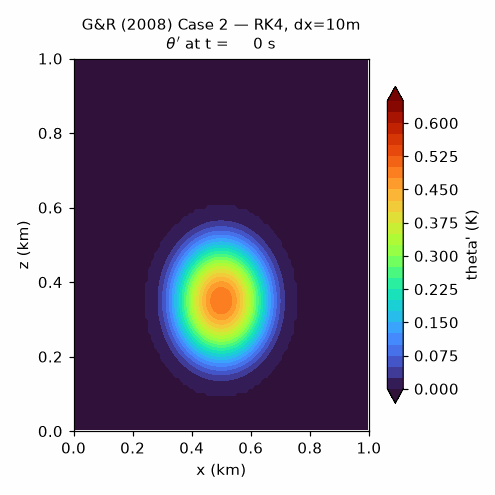
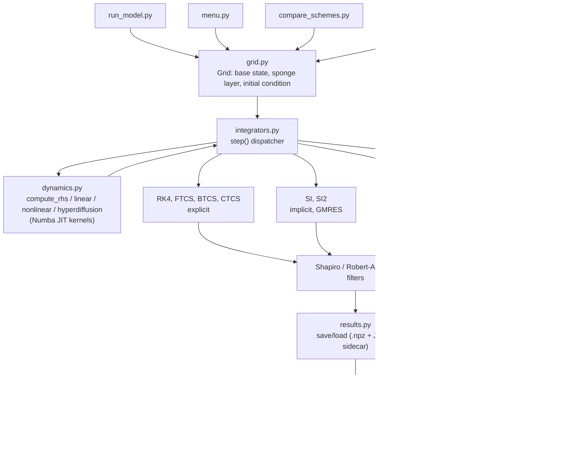
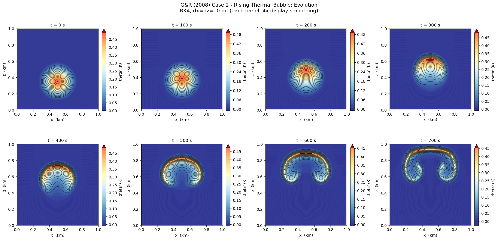
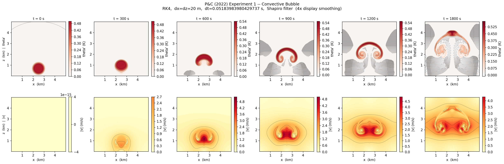

<div align="center">

# 2D Non-Hydrostatic Compressible Atmospheric Model

**MSc Dissertation — Data & Computational Science**

University College Dublin &nbsp;|&nbsp; ACM40910 &nbsp;|&nbsp; Supervisor: Dr Colm Clancy (UCD)


[](https://github.com/ALEN2002-py/2d-atmospheric-model/actions/workflows/ci.yml)




*The classic "mushroom cap" instability, formed from a genuine RK4 run of this
solver — not a cached image from the source papers. See [§9](#9-benchmark-test-cases)
for the full validation against Giraldo & Restelli (2008).*

```bash
git clone https://github.com/ALEN2002-py/2d-atmospheric-model.git && cd 2d-atmospheric-model
docker build -t atmospheric-sim . && docker run atmospheric-sim
```

</div>

---

## Table of Contents

1. [Project Overview](#1-project-overview)
2. [Governing Equations](#2-governing-equations)
3. [Operator Splitting](#3-operator-splitting)
4. [Base State](#4-base-state)
5. [Numerical Discretisation](#5-numerical-discretisation)
6. [Time Integration Schemes](#6-time-integration-schemes)
7. [Stability Constraints](#7-stability-constraints)
8. [Numerical Diffusion and Filtering](#8-numerical-diffusion-and-filtering)
9. [Benchmark Test Cases](#9-benchmark-test-cases)
10. [Efficiency and Convergence Results](#10-efficiency-and-convergence-results)
11. [Repository Structure](#11-repository-structure)
12. [Getting Started](#12-getting-started)
13. [Running the Experiments](#13-running-the-experiments)
14. [Development Status](#14-development-status)
15. [References](#15-references)

---

## 1. Project Overview

This repository implements a **2D non-hydrostatic compressible atmospheric model**
in Python. The scientific goal is a systematic comparison of the efficiency and
accuracy of time integration schemes — classical Runge-Kutta, semi-implicit (1st
and 2nd order), and exponential propagation iterative (EPI) methods — when applied
to the compressible Euler equations governing dry atmospheric convection.

The **novel contribution** is a *measured* efficiency frontier (error vs CPU time,
built from real runs rather than literature numbers) that directly compares these
schemes on the same benchmark. Neither Robert (1993) nor Pudykiewicz & Clancy (2022)
provide this comparison. That measurement produced a genuinely interesting result:
**at the primary benchmark resolution (Δx=10m), plain RK4 is both faster and more
accurate than every tested semi-implicit configuration** — see §10 for the full
result and its scope. This is presented as an honest finding, not smoothed over,
because it is more useful (and more defensible) than an assumed positive result
would have been.

The primary validation benchmark is the **rising thermal bubble** test case of
Giraldo & Restelli (2008, Case 2), chosen because it runs stably without explicit
diffusion, making it a clean platform for isolating temporal integration errors.
A secondary benchmark, Pudykiewicz & Clancy (2022) Experiment 1, is used to test
the same schemes at their published resolution and Courant numbers.

### Headline result, at a glance

Every number below is *measured* by `experiments/gr_dt_efficiency_sweep.py`
(G&R Case 2, Δx=10m) — none are hardcoded or taken from a paper. Full detail,
caveats, and scope of this comparison are in [§10.2](#10-efficiency-and-convergence-results).

| Scheme | Best config | Wall time | Error vs G&R ref (0.570K) |
|--------|-------------|-----------|----------------------------|
| **RK4** | Δt=0.02s | **128.5 s** | **7.8%** |
| SI | Δt=2.0s | 635.2 s | 13.1% |
| SI2 | Δt=4.0s | 1046.9 s | 11.3% |
| ETD1V | Δt=8.0s | 215.7 s | 3.0% |

### Architecture at a glance


```mermaid
flowchart TD
    E1[run_model.py] --> G
    E2[menu.py] --> G
    E3[compare_schemes.py] --> G
    E4["experiments/*.py"] --> G

    G["grid.py
Grid: base state, sponge layer, initial condition"] --> S

    S["integrators.py
step() dispatcher"] --> D["dynamics.py
compute_rhs / linear / nonlinear / hyperdiffusion
(Numba JIT kernels)"]
    D --> S

    S --> SCH1["RK4, FTCS, BTCS, CTCS
explicit"]
    S --> SCH2["SI, SI2
implicit, GMRES"]
    S --> SCH3["SI2LU
implicit, sparse LU"]
    S --> SCH4["ETD1, ETD1V, EPI3
Krylov phi-functions"]

    SCH1 --> F["Shapiro / Robert-Asselin filters"]
    SCH2 --> F
    SCH3 --> F
    SCH4 --> F

    F --> R["results.py
save/load (.npz + JSON sidecar)"]
    R --> P["io.py / plot_results.py
figures"]
    P --> A["assets/, output/figures/"]
```

Every entry point builds a `Grid` (base state + initial condition), then drives
it forward through `integrators.py`'s `step()` dispatcher — a single API across
all 10 schemes (see [§6](#6-time-integration-schemes)) — before handing the
result to `results.py` / `io.py` for saving and plotting.

---

## 2. Governing Equations

The model solves the **compressible Euler equations in θ-π perturbation form** on a
2D vertical $(x, z)$ slice. Prognostic variables are split into a horizontally
uniform, time-invariant base state (overbar) and a perturbation (prime):

$$\theta = \bar{\theta}(z) + \theta'(x,z,t), \qquad \pi = \bar{\pi}(z) + \pi'(x,z,t)$$

The four prognostic equations are:

$$\frac{\partial u}{\partial t} = -u\frac{\partial u}{\partial x} - w\frac{\partial u}{\partial z} - c_p \left(\bar{\theta} + \theta'\right)\frac{\partial \pi'}{\partial x}$$

$$\frac{\partial w}{\partial t} = -u\frac{\partial w}{\partial x} - w\frac{\partial w}{\partial z} - c_p \left(\bar{\theta} + \theta'\right)\frac{\partial \pi'}{\partial z} + g\frac{\theta'}{\bar{\theta}}$$

$$\frac{\partial \pi'}{\partial t} = -u\frac{\partial \pi'}{\partial x} - w\frac{\partial \pi'}{\partial z} - \frac{R}{c_v} \left(\bar{\pi} + \pi'\right) \left(\frac{\partial u}{\partial x} + \frac{\partial w}{\partial z}\right) + \frac{gw}{c_p \bar{\theta}}$$

$$\frac{\partial \theta'}{\partial t} = -u\frac{\partial \theta'}{\partial x} - w\frac{\partial \theta'}{\partial z} - w\frac{d\bar{\theta}}{dz}$$

The buoyancy term $g\,\theta'/\bar{\theta}$ in (2) drives convection.
The acoustic source $(\partial u/\partial x + \partial w/\partial z)$ in (3) generates
fast sound waves ($c_s \approx 347\,\mathrm{m\,s^{-1}}$) that make the system stiff.

---

## 3. Operator Splitting

For SI, SI2 and EPI schemes the RHS is split into linear and nonlinear parts:

$$\frac{dq}{dt} = \mathcal{L}q + \mathcal{N}(q)$$

- **$\mathcal{L}q$** (linear, stiff): acoustic pressure gradients, buoyancy,
  base-state advection. Contains the fast waves.
- **$\mathcal{N}(q)$** (nonlinear, slow): advection terms
  $u\,\partial(\cdot)/\partial x$, $w\,\partial(\cdot)/\partial z$.

---

## 4. Base State

The default base state is **isentropic** (neutral stratification, $d\bar{\theta}/dz = 0$):

$$\bar{\theta}(z) = T_0 = 300\,\mathrm{K} \quad \text{(constant)}, \qquad
\bar{\pi}(z) = 1 - \frac{gz}{c_p T_0}$$

This gives $N^2 = 0$ so the bubble rises freely with no restoring force — matching G&R (2008) Case 2 exactly. An isothermal base state is also available but produces Brunt-Väisälä oscillations ($N \approx 0.018\,\mathrm{s^{-1}}$, period $\approx 350\,\mathrm{s}$) that suppress the bubble.

---

## 5. Numerical Discretisation

| Component | Choice |
|---|---|
| Spatial grid | Unstaggered — all four variables on the same $(n_z \times n_x)$ cell-centre points |
| $x$-derivatives | 2nd-order centred, periodic boundary conditions |
| $z$-derivatives | 2nd-order centred interior, 1st-order one-sided at top/bottom |
| Performance | Numba JIT compilation for derivative kernels (10–50× faster on large grids) |
| Top/bottom BCs | $w = 0$, $\;\partial\theta'/\partial t = 0$ (rigid lid) |
| Sponge layer | Rayleigh damping ($\sin^2$ ramp) in top 20% of domain — **off by default** (`sponge_strength=0`); neither benchmark in §9 specifies one, and enabling it measurably biases results on G&R's short domain (§10.5) |


---

## 6. Time Integration Schemes

**Ten** schemes are implemented in `src/integrators.py`, dispatched through a
single `step()` function.

| # | Key | Description | Order | Acoustic CFL |
|:---:|---|---|:---:|:---:|
| 1 | FTCS | Forward Euler | 1st | Required |
| 2 | BTCS | Heun's method (2-stage RK, mislabelled — not backward Euler) | 2nd | Required |
| 3 | CTCS | Leapfrog + Robert-Asselin filter | 2nd | Required |
| 4 | RK4 | Classical 4-stage Runge-Kutta | 4th | Required |
| 5 | SI | Semi-implicit IMEX (GMRES), explicit-Euler $\mathcal{N}$ | 1st | **Removed** |
| 6 | SI2 | Semi-implicit leapfrog (GMRES), centred $\mathcal{N}$ | 2nd | **Removed** |
| 7 | SI2LU | SI2, solved via a one-time sparse-LU factorisation instead of GMRES every step (same math, ~10-200× fewer solver iterations) | 2nd | **Removed** |
| 8 | ETD1 | Exponential time differencing, Krylov, $J_n \approx \mathcal{L}$ (constant) | 1st | **Removed** |
| 9 | EPI3 | ETD1 + second-order correction, $J_n \approx \mathcal{L}$ | 3rd* | **Removed** |
| 10 | ETD1V | ETD1 with a per-step frozen-advection linear operator $\mathcal{L}_n = \mathcal{L} + A(q^n)$ — fixes ETD1's wrong-physics bug (§6.3, §6.4) | 1st | **Removed** |

*EPI3's third-order property holds at small $\Delta t$ with the constant-linear-part
approximation $J_n \approx \mathcal{L}$. At large $\Delta t$, plain ETD1/EPI3 fail to
reproduce the correct rising-bubble physics (mushroom cap) — see §6.3.

**Naming note**: schemes 8 and 10 were originally implemented and labelled
"EPI2"/"EPI2V", on the assumption that reusing Pudykiewicz & Clancy (2022)'s
exponential update formula was enough to match their method. This is incorrect —
their actual EPI2 uses the full, continually-updated system Jacobian $J_n$
(Tokman 2006), which is what makes it 2nd order. Approximating $J_n$ by a
constant $\mathcal{L}$, as done here, is instead the ETD1 scheme of Cox &
Matthews (2002), and is only 1st order. Renamed throughout the codebase and
this README to ETD1/ETD1V to reflect this — thank you to Dr Clancy for
catching it.

### 6.1 Semi-implicit (SI) — 1st order

$(I - \tfrac{\Delta t}{2}\mathcal{L})\,q^{n+1} = (I + \tfrac{\Delta t}{2}\mathcal{L})\,q^n + \Delta t\,\mathcal{N}(q^n)$

Solved with GMRES. The explicit-Euler treatment of $\mathcal{N}$ makes the
overall scheme **1st order** in time.

### 6.2 Semi-implicit leapfrog (SI2) — 2nd order

Both $\mathcal{L}$ and $\mathcal{N}$ are centred, following the same 3-level
structure as CTCS:

$$\frac{q^{n+1} - q^{n-1}}{2\Delta t} = \frac{1}{2}\left(\mathcal{L}q^{n+1} + \mathcal{L}q^{n-1}\right) + \mathcal{N}(q^n)$$

$$\Rightarrow\quad (I - \Delta t\,\mathcal{L})\,q^{n+1} = (I + \Delta t\,\mathcal{L})\,q^{n-1} + 2\Delta t\,\mathcal{N}(q^n)$$

Also solved with GMRES; bootstraps step 0 with SI. The 3-level structure introduces
a spurious computational mode, damped with a Robert-Asselin filter in time
(`robert_asselin_filter_time`, $\alpha=0.1$, applied every step).

**Measured trade-off (§10): SI2 is consistently more accurate and more robust than
SI — it tolerates larger $\Delta t$ and finer $\Delta x$ before its own explicit-$\mathcal N$
stability limit is reached — but it is also consistently *slower*, since its implicit
operator $(I-\Delta t\,\mathcal L)$ is stiffer for GMRES than SI's $(I-\tfrac{\Delta t}{2}\mathcal L)$,
requiring more iterations per solve at matched $\Delta t$.**

**SI2LU** removes that GMRES cost: since $(I - \Delta t\,\mathcal{L})$ is the same
matrix at every step (for a fixed $\Delta t$ and grid), it is factorised once via
`scipy.sparse.linalg.splu` (sparse LU, not a stored inverse) and every subsequent
step is just two triangular solves against the new right-hand side. Validated to
machine precision against the GMRES solution. Only viable in 2D — in 3D the LU
factors lose the sparsity of the original matrix (fill-in), which is why Krylov
methods remain standard for large 3D operational models.

### 6.3 ETD1 / EPI3 — Krylov sub-step approach, and a known limitation

$e^{\mathcal{L}\Delta t}$ is never formed explicitly. The Arnoldi algorithm builds
an $m$-dimensional Krylov basis and evaluates the $\varphi$ functions on a small
Hessenberg matrix via `scipy.linalg.expm`. For large acoustic Courant numbers, the
implementation subdivides $\Delta t$ into $p$ sub-steps of size $h=\Delta t/p$, chosen
so $c_s\pi h/\Delta x \le 15$ per sub-step, keeping the total Krylov work roughly
independent of $\Delta t$.

With $\mathcal{L}$ as a **constant** linear operator (acoustics + buoyancy only, no
advection), plain ETD1/EPI3 fail to reproduce the mushroom cap at large $\Delta t$:
since $\mathcal{L}\theta' = -w\,d\bar\theta/dz = 0$ for the isentropic base state,
$\exp(\mathcal{L}\Delta t)$ never transports $\theta'$, and buoyancy over-accelerates
$w$ with no feedback. Confirmed directly with real numbers on both benchmarks: on
G&R Case 2 the bubble grows in place without rising; on P&C Experiment 1 the failure
is far more severe, $|\mathbf v|_{\max}$ runs away to over $10{,}000\,\mathrm{m\,s^{-1}}$
by the end of the run. Plain ETD1/EPI3 are kept in the codebase deliberately, as a
documented negative result — see §6.4 for the fix.

### 6.4 ETD1V — a frozen-advection fix for ETD1

ETD1V augments the constant $\mathcal{L}$ with a per-step transport operator built
from the *current* step's own velocity field:

$$\mathcal{L}_n = \mathcal{L} + A(q^n), \qquad A(q^n)f = -u^n\frac{\partial f}{\partial x} - w^n\frac{\partial f}{\partial z}$$

so $\exp(\mathcal{L}_n \Delta t)$ transports **every** field, including $\theta'$,
using the current velocity — not just acoustics/buoyancy as in plain ETD1. The
spectral radius of $\mathcal{L}_n$ is still dominated by acoustics, so the same
sub-step count and Krylov dimension work as plain ETD1, at roughly $2\times$ the
matvec cost. Diffusion, when set, is folded directly into $\mathcal{L}_n$ and so is
integrated *exactly* by the matrix exponential — unlike SI/SI2's forward-Euler
diffusion correction, ETD1V's diffusion has no CFL-type cap on $\kappa$.

Validated on both benchmarks against the same references used throughout this
README: on G&R Case 2 (dx=10m, dt=1s, t=700s, unfiltered) ETD1V gives
$\theta'_{\max}=0.602\,\mathrm K$ against the G&R SE/DG range of $0.538$–$0.570\,\mathrm K$,
with a correctly-formed mushroom cap and twin counter-rotating vortices, at a wall
time of $146$–$162\,\mathrm s$ — faster than RK4 and SI2 (§10.2). On P&C Experiment 1
(with Shapiro filtering) it gives $\theta'_{\max}=0.478\,\mathrm K$ and
$w_{\max}=3.806\,\mathrm{m\,s^{-1}}$ against the paper's own velocity scale of
$3.62\,\mathrm{m\,s^{-1}}$, about 12% slower than plain (wrong-physics) ETD1 for
correct physics.

A second, full-Jacobian variant (ETD1FJ, using Pudykiewicz & Clancy's own
$\mathbf J_n$ rather than the frozen-advection $\mathcal{L}_n$) was also built and
tested, but diverges on both benchmarks after 15–90 seconds of simulated time
because its sub-step count is calibrated only against the acoustic spectral radius,
not the full Jacobian's own growing radius once advection is included. Fixing this
would need an adaptive sub-step count, not pursued since ETD1V already satisfies the
physics requirement — this is documented as an honest dead end, not carried forward
in the codebase.

---

## 7. Stability Constraints

### 7.1 Acoustic CFL (explicit schemes)

For leapfrog on a 2D acoustic system:

$$\text{CFL}_{2D} = \frac{c_s \Delta t \sqrt{2}}{\Delta x} \leq 1$$

With $c_s = 347\,\mathrm{m\,s^{-1}}$, $\Delta x = 10\,\mathrm{m}$:

- CTCS/FTCS: max safe $\Delta t \approx 0.020\,\mathrm{s}$
- RK4: $\Delta t \lesssim 0.026\,\mathrm{s}$ (in practice CFL≈0.35–0.69 used; at
  $\Delta x$=10m RK4 is already time-converged by $\Delta t$=0.02s — see §10)
- SI / SI2 / EPI (acoustic CFL removed): $\Delta t$ from ~1s up to ~15s tested

### 7.2 Advective CFL (SI, SI2, EPI — explicit $\mathcal{N}$)

Removing the acoustic constraint does not remove *all* time-step limits: the
explicit treatment of $\mathcal{N}(q^n)$ (advection) has its own CFL-type bound,

$$\text{CFL}_{\text{adv}} = \frac{|w|_{\max}\,\Delta t}{\Delta x} \lesssim 1$$

Confirmed directly: SI at $\Delta x=10\,\mathrm{m}$ blows up at $\Delta t=4$s and 8s
once the mushroom cap forms and $w$ grows large enough to cross this threshold
(mid-run, not immediately — see §10). The same mechanism, intensified, is why SI's
diffusion strategies that worked at $\Delta x=10\,\mathrm m$ mostly fail at
$\Delta x=5\,\mathrm m$ with $\Delta t$ held fixed (CFL$_\text{adv}$ grows as $\Delta x$
shrinks) — see §10. SI2 has so far tolerated larger $\Delta t$ and finer $\Delta x$
than SI before hitting this same wall; the mechanism for that difference is not yet
confirmed (working hypothesis: SI2's centred treatment of $\mathcal L$ tracks the
true velocity field more accurately, keeping CFL$_\text{adv}$ further from its
threshold — untested directly).

### 7.3 Diffusion stability — and why it cannot be folded into a leapfrog scheme

Explicit hyper­diffusion added to $\mathcal N$ is only conditionally stable
(forward-Euler-type bound $\kappa\lambda_{\max}\Delta t \le 2$) **when $\mathcal N$
itself is treated with a single-level (2-level) update, as in SI**. Folding the same
diffusion term directly into a **3-level leapfrog** scheme's $\mathcal N(q^n)$ (as
originally attempted for SI2) is a different story entirely: a von Neumann analysis
of the leapfrog recurrence for a purely diffusive (real, non-oscillatory) eigenvalue
$\lambda$ gives a spurious computational-mode root of magnitude
$\beta + \sqrt{\beta^2+1}$, where $\beta = \kappa\lambda\Delta t$ — **strictly greater
than 1 for every $\beta>0$, with no stability threshold on $\kappa$ or $\Delta t$ at
all** (Durran 2010; Jablonowski & Williamson 2011, Ch. 13). Confirmed empirically:
folding diffusion into SI2's leapfrog term made nabla4/nabla8 blow up almost
immediately and nabla2 within ~200s, regardless of how small $\kappa$ was chosen.

**Fix**: solve the wave/advection part first with the ordinary SI2 update, then apply
diffusion as a *separate*, single-level forward-Euler correction over one $\Delta t$
(not $2\Delta t$), **outside** the leapfrog recurrence. This restores the ordinary
conditional bound $\kappa\lambda_{\max}\Delta t\le2$ — the same one already used for
SI, no halving needed — and is validated in §10 across every diffusion variant tested.
This is the same technique recommended in Jablonowski & Williamson (2011) for
diffusion in semi-implicit models generally.

---

## 8. Numerical Diffusion and Filtering

To suppress grid-scale (2Δx) numerical noise from centred finite differences, three
hyperdiffusion operators and a spatial filter are implemented and compared, for
**both** the RK4 family and the SI/SI2 family (each with its own tuned reference
values and stability treatment — see §7.3 for why SI2 needed a different approach).

### 8.1 Operators

| Variant | Operator | RHS term |
|---------|----------|----------|
| ∇² | Laplacian | $+\kappa_2 \nabla^2 q$ |
| ∇⁴ | Biharmonic | $-\kappa_4 \nabla^4 q$ |
| ∇⁸ | Octaharmonic | $+\kappa_8 \nabla^8 q$ |
| Shapiro | 1-2-1 separable filter | applied every ~30 s |

Higher-order operators are more **scale-selective**: they damp the 2Δx wave strongly
while leaving larger-scale features (the bubble, vortex cap) almost untouched — at
the cost of also being less able to control a *broadband* instability (see §10's
higher-resolution results, where ∇⁸ and Shapiro fail at finer $\Delta x$ precisely
because the intensified instability there is no longer confined to 2Δx).

### 8.2 κ values and timescale argument

Reference values differ between the RK4 diffusion-comparison scripts and the
SI/SI2 diffusion-comparison scripts (tuned independently for each scheme family's
own $\Delta t$ and stability behaviour — see `experiments/gr_diffusion_comparison.py`
vs `experiments/gr_si_diffusion_comparison.py`). Both use the same underlying
timescale argument: choose $\kappa$ so the **damping timescale at the 2Δx wave** is
~30–100 s,

$$\tau = \frac{1}{\kappa \left(\pi/\Delta x\right)^n}$$

fast enough to suppress noise but well below the bubble evolution time, then cap at
the relevant stability limit for the scheme in question:

- **RK4 / explicit schemes**: $\kappa\cdot(8/\Delta x^n)\cdot\Delta t \le 2.79$ (70% safety factor).
- **SI and SI2 (post-§7.3 fix)**: $\kappa\cdot\lambda_{\max}\cdot\Delta t \le 2$, where
  $\lambda_{\max}=(8/\Delta x^2)^{n/2}$ — the same bound for both schemes now that
  diffusion is a single-level correction in both cases.

At $\Delta x=10\,\mathrm m$, SI/SI2: $\kappa_2=3\,\mathrm{m^2s^{-1}}$,
$\kappa_4=200\,\mathrm{m^4s^{-1}}$, $\kappa_8=2\times10^4\,\mathrm{m^8s^{-1}}$.

---

## 9. Benchmark Test Cases

### 9.1 Giraldo & Restelli (2008) Case 2 — Rising Thermal Bubble

The primary benchmark for the efficiency comparison. A warm cosine-shaped
perturbation rises in a neutrally stratified atmosphere.

$$\theta'(x,z,0) = \frac{\theta_c}{2}\left(1 + \cos\frac{\pi r}{r_c}\right), \quad r \leq r_c; \qquad \theta' = 0, \quad r > r_c$$

where $r = \sqrt{(x-x_c)^2 + (z-z_c)^2}$.

| Parameter | Value |
|---|---|
| Domain | $1\,\mathrm{km} \times 1\,\mathrm{km}$ |
| Resolutions tested | $\Delta x = \Delta z = 10\,\mathrm{m}$ (primary, $100\times100$) and $5\,\mathrm{m}$ ($200\times200$, resolution study) |
| $\theta_c$ | $0.5\,\mathrm{K}$ |
| Bubble radius $r_c$ | $250\,\mathrm{m}$ |
| Bubble centre $(x_c, z_c)$ | $(500\,\mathrm{m},\ 350\,\mathrm{m})$ |
| Integration time | $700\,\mathrm{s}$ |
| RK4 $\Delta t$ | $0.01$–$0.02\,\mathrm{s}$ (35 000–70 000 steps) |
| SI / SI2 $\Delta t$ | $1\,\mathrm{s}$ (700 steps, advective Courant $\approx 0.25$; acoustic Courant $\approx 35$) |

This case runs cleanly **without explicit diffusion or filtering** for RK4, which
keeps the temporal error analysis clean. SI and SI2 require diffusion or a Shapiro
filter to remain stable through the full 700s once the mushroom cap forms (§7.2,
§10) — this is itself a useful contrast documented in the results.



### 9.2 Pudykiewicz & Clancy (2022) Experiment 1

A wider domain with a larger bubble, used to test the schemes at the resolution and
Courant numbers of the original paper.

| Parameter | Value |
|---|---|
| Domain | $5\,\mathrm{km} \times 5\,\mathrm{km}$ |
| Resolution (paper) | $\Delta x = \Delta z = 20\,\mathrm{m}$ → $250 \times 250$ grid |
| Bubble | $\theta' = 0.5\,\mathrm{K}$ cylinder with Gaussian edge |
| RK4 $\Delta t$ | CFL-limited (~0.02–0.03s at $\Delta x$=20–40m) |
| SI / SI2 $\Delta t$ | $5\,\mathrm{s}$ (advective-CFL-limited, not acoustic) |
| Integration time | up to $1800\,\mathrm{s}$ (full paper duration; shorter subsets used for cheaper sweeps) |

Note: this case requires explicit diffusion or filtering to run beyond about
10–15 minutes of simulated time, for every scheme tested so far. SI/SI2 diffusion
comparison, GMRES performance, and dt-efficiency infrastructure exist for this case
(mirroring §9.1's G&R tooling) but have not yet been run at the paper's full
$\Delta x=20\,\mathrm m$ resolution — see §13.



### 9.3 Convergence study — Robert (1993) small-domain benchmark

| Parameter | Value |
|---|---|
| Domain | $1\,\mathrm{km} \times 1\,\mathrm{km}$ |
| Resolution | $\Delta x = \Delta z = 10\,\mathrm{m}$ |
| Gaussian bubble | $A = 2\,\mathrm{K}$, $r = 150\,\mathrm{m}$, centre $(500, 400)\,\mathrm{m}$ |
| Integration time | $2\,\mathrm{s}$ (convergence) |

---

## 10. Efficiency and Convergence Results

### 10.1 Temporal order of accuracy

Reference: RK4 at $\Delta t = 0.002\,\mathrm{s}$, $t_{\text{end}} = 2\,\mathrm{s}$.

| Scheme | Observed order | Notes |
|---|:---:|---|
| RK4 | 4th | Textbook |
| CTCS | 2nd → floor | Spatial error floor at L2 $\approx 5\times10^{-5}$ |
| SI | 1st | Explicit-Euler $\mathcal{N}$ limits order |
| SI2 | 2nd | Centred $\mathcal{N}$ (leapfrog) restores 2nd order |
| ETD1 | 1st* | Wrong physics at large $\Delta t$ regardless of order — see §6.3 |
| EPI3 | 3rd | At small $\Delta t$; collapses toward ETD1 at large $\Delta t$ without the full Jacobian |
| ETD1V | 1st* | Frozen-advection fix for ETD1 — see §6.4 |

*Formally 1st order by construction (Cox & Matthews 2002, constant-$\mathcal L$
approximation of $J_n$ — see the naming note in §6). A dedicated convergence
sweep isolating ETD1/ETD1V's own temporal order (independent of the fixed
spatial-discretisation gap against the G&R reference) has not yet been run —
see §10.2's error-vs-$\Delta t$ discussion for what a first attempt at this
showed.

### 10.2 Measured efficiency frontier (G&R Case 2, Δx=10m) — headline result

Built by `experiments/gr_dt_efficiency_sweep.py`: every point below is *measured*,
not looked up or hardcoded. Blown-up runs are excluded.

| Scheme | Best config | Wall time | Error vs G&R ref (0.570K) |
|--------|-------------|-----------|----------------------------|
| **RK4** | $\Delta t=0.02$s | **128.5 s** | **7.8%** |
| SI | $\Delta t=2.0$s | 635.2 s | 13.1% |
| SI2 | $\Delta t=4.0$s | 1046.9 s | 11.3% |
| ETD1V | $\Delta t=8.0$s | 215.7 s | 3.0% |

**RK4 is both faster and more accurate than every valid SI/SI2 configuration
tested; ETD1V sits close behind RK4 on speed while beating it on accuracy at
this resolution**, and never blows up across the full $\Delta t=0.02$–$8$s
range swept (§6.4). Mechanism for the RK4-vs-SI/SI2 gap: RK4 needs zero
artificial diffusion at this resolution (§9.1), so it captures the true dynamics
faithfully; SI/SI2 *require* diffusion to stay stable, which biases
$\theta'_{\max}$ away from the reference, and GMRES iteration cost (§10.3) erodes
the "fewer steps" advantage semi-implicit schemes are supposed to provide. Also
confirmed: RK4 at $\Delta t=0.02$s and $\Delta t=0.01$s give an
**identical** $\theta'_{\max}=0.614\,\mathrm K$ — at this resolution RK4 is already
time-converged by $\Delta t=0.02$s, and the residual ~8% error vs the G&R reference
is entirely spatial ($\Delta x=10\,\mathrm m$ vs the paper's 5m).

**Scope of this result**: our SI/SI2 use plain, **unpreconditioned** GMRES with a
tight tolerance (atol=1e-10, rtol=1e-8). The correct claim is *"for this specific
unpreconditioned implementation, at $\Delta x=10\,\mathrm m$, RK4 wins on both speed
and accuracy"* — not a general claim that semi-implicit methods are inherently
worse. A preconditioned solve could plausibly change this conclusion; not yet tested.

**A confound to flag whenever this table is quoted**: the diffusion coefficient
$\kappa$ is automatically capped tighter at larger $\Delta t$ (§7.3/§8.2), so part of
"SI/SI2 accuracy improving with $\Delta t$" reflects *less damping* at larger
$\Delta t$, not purely improving temporal truncation error. The efficiency-frontier
plot itself annotates $\kappa$ at every point for this reason.

**Error vs. $\Delta t$ directly** (as opposed to error vs. wall time above) was
also swept for ETD1V, in direct response to the supervisor's request for evidence
of its formal order of accuracy. It does not give a clean answer either way:
ETD1V's error *falls* as $\Delta t$ grows (8.1% at $\Delta t=0.02$s down to 3.0%
at $\Delta t=8$s), the opposite of what a convergent scheme should show as
$\Delta t\to0$. The likely cause is that the G&R reference is fixed at
$\Delta x=5\,\mathrm m$ while every run here is at $\Delta x=10\,\mathrm m$, so
the fixed spatial-discretisation gap dominates the measured error at every
$\Delta t$ — the same effect noted above for RK4. Properly isolating ETD1V's
temporal order would need a self-referenced convergence test (successive
$\Delta t$ compared against each other at fixed, fine $\Delta x$) rather than
against G&R's coarser-resolution table — not yet done; left as an open item.

### 10.3 GMRES cost vs Δt (G&R Case 2, Δx=10m)

Built by `experiments/gr_gmres_performance.py`. GMRES iteration count grows steeply
and essentially monotonically with $\Delta t$ for both schemes — a real, clean,
reproducible cost that erodes the wall-time benefit of taking larger steps:

| Δt (s) | SI mean iters | SI2 mean iters |
|---|---|---|
| 0.25 | 64 | 104 |
| 0.5 | 147 | 272 |
| 1.0 | 334 | 582 |
| 2.0 | 818 | 1236 |
| 4.0 | blows up (see note below) | 2862 |

SI blows up at $\Delta t=4$s and 8s via the advective CFL mechanism (§7.2), not a
GMRES/diffusion failure. SI2 tolerates $\Delta t=4$s where SI does not, at the same
$\Delta x$ — the open mechanism question noted in §6.2/§7.2.

### 10.4 Higher resolution (Δx=5m) — does the picture change?

At $\Delta x=5\,\mathrm m$ with $\Delta t$ held at 1s (so CFL$_\text{adv}$ intensifies,
§7.2), most previously-stable SI diffusion strategies fail:

| Variant | SI (5 variants tested) | SI2 (∇²/∇⁴/∇⁸ tested) |
|---|---|---|
| IDEAL (no diffusion) | Blows up t=460s | not tested |
| ∇² | Stable, $\theta'_{\max}=0.411$K | Stable, $\theta'_{\max}=0.411$K |
| ∇⁴ | "Survives" but $\theta'_{\min}=-0.997$K (severe ringing) | Stable, $\theta'_{\max}=0.561$K |
| ∇⁸ | Blows up t=540s | Stable, $\theta'_{\max}=0.636$K |
| Shapiro | Blows up t=673s | not tested |

**Conclusion**: pushing SI to finer resolution at the same $\Delta t$ doesn't just
cost more (wall time increased 6–9× for a 2× $\Delta x$ refinement, more than the
4×-grid-points-alone explanation — GMRES cost also scales worse than linearly with
problem size) — it breaks most previously-working diffusion strategies. SI2 is
noticeably more robust at finer resolution too, consistent with its dt=4s result
above, though not yet mechanistically explained.

### 10.5 Two regressions found and fixed, re-validated against reference

Two silent (non-crashing) numerical regressions were introduced and caught during
this project, both found by directly comparing fresh runs against already-documented
reference values rather than by inspection:

1. **GMRES tolerance.** `rtol` on the SI/SI2 linear solves was loosened from
   $10^{-8}$ to $10^{-5}$ after a single-solve benchmark showed only a 0.34%
   difference in the solved state — this looked safe in isolation but compounded to
   a **30% error** in $\theta'_{\max}$ over a full 700-step run in this nonlinear
   (vortex-roll-up) system. Reverted to $10^{-8}$.
2. **Sponge layer default.** Once wired into the RHS, `sponge_strength` defaulted
   to a nonzero value that was validated only against P&C's taller domain (where it
   was negligible) and never re-checked against G&R's own reference values. On
   G&R's 1km domain the sponge's top-20% zone coincides with where the mushroom cap
   rises to by t=700s, biasing $\theta'_{\max}$/$w_{\max}$ ~9–10% low. Fixed by
   defaulting `sponge_strength=0` — neither benchmark's specification calls for one.

**Re-validated after both fixes** (dx=10m, t=700s, all 10 SI+SI2 diffusion
variants): every value matches the pre-existing documented reference to 3 decimal
places (e.g. SI nabla8: 0.8179K measured vs. 0.818K reference; SI2 IDEAL: 0.5961K
vs. 0.596K). The takeaway generalised for future changes to the core integrators or
grid defaults: a numerical change that looks negligible in a single-step or
single-benchmark check can still be wrong once run end-to-end or applied to a
different configuration — both require direct verification, not just plausibility.

---

## 11. Repository Structure

```
2d-atmospheric-model/
│
├── src/
│   ├── grid.py            # Unstaggered grid, isentropic base state, sponge layer
│   ├── dynamics.py        # compute_rhs / compute_linear_rhs / compute_nonlinear_rhs
│   │                       # compute_hyperdiffusion_rhs (nabla^2/4/8); Numba JIT kernels
│   ├── integrators.py     # step() dispatcher, 10 schemes (FTCS..EPI3, SI2LU, ETD1V),
│   │                       # Shapiro filter, Robert-Asselin filters, SI2 diffusion correction
│   ├── results.py         # Save/load experiments (.npz + JSON sidecar)
│   ├── physics.py         # Physical constants and derived quantities
│   └── io.py              # Output helpers
│
├── experiments/
│   ├── gr_case2_benchmark.py          # G&R (2008) Case 2 — all schemes, --scheme flag
│   ├── gr_diffusion_comparison.py     # G&R Case 2 — RK4 diffusion/Shapiro comparison
│   ├── gr_si_diffusion_comparison.py  # G&R Case 2 — SI/SI2 diffusion/Shapiro comparison
│   │                                   # (parallel, --variants, result caching + replot)
│   ├── gr_gmres_performance.py        # G&R Case 2 — GMRES cost vs dt for SI/SI2
│   ├── gr_dt_efficiency_sweep.py      # G&R Case 2 — real measured RK4 vs SI2 vs ETD1V
│   ├── gr_etd1v_diffusion_comparison.py # G&R Case 2 — ETD1V diffusion/Shapiro comparison
│   ├── gr_kappa_sweep.py              # G&R Case 2 — RK4 kappa value sweep
│   ├── gr_vertical_profile.py         # G&R Case 2 — vertical profile only (fast)
│   ├── gr_efficiency.py               # G&R Case 2 — earlier RK4-focused efficiency study
│   ├── pc_exp1_benchmark.py           # P&C (2022) Exp 1 — all schemes, --scheme flag
│   ├── pc_diffusion_comparison.py     # P&C Exp 1 — RK4 diffusion/Shapiro comparison
│   ├── pc_si_diffusion_comparison.py  # P&C Exp 1 — SI/SI2 diffusion/Shapiro comparison
│   ├── pc_gmres_performance.py        # P&C Exp 1 — GMRES cost vs dt for SI/SI2
│   ├── pc_dt_efficiency_sweep.py      # P&C Exp 1 — real measured RK4 vs SI vs SI2
│   ├── pc_kappa_sweep.py              # P&C Exp 1 — RK4 kappa value sweep
│   ├── pc_vertical_profile.py         # P&C Exp 1 — vertical profile only
│   ├── pc_etd1v_diffusion_comparison.py # P&C Exp 1 — ETD1V diffusion/Shapiro comparison
│   ├── pc_etd1v_final_comparison.py   # P&C Exp 1 — consolidated best-tuned ETD1V comparison
│   ├── plot_efficiency_frontier.py    # Earlier efficiency plot (RK4 measured; SI/EPI
│   │                                   # points hardcoded — superseded by
│   │                                   # gr_dt_efficiency_sweep.py for SI/SI2/ETD1V)
│   ├── plot_initial_conditions.py     # IC visualisation for both benchmarks
│   └── efficiency_study.py            # Convergence study (small domain, t_end=2s)
│
├── compare_schemes.py    # Driver: convergence + heatmap + efficiency + time series
├── menu.py               # Interactive scheme selector
├── run_model.py          # Simple command-line runner
├── run_all.py            # Full test suite runner
├── plot_results.py       # Plotting utilities
│
├── tests/
│   ├── test_grid.py
│   └── test_integrators.py   # Zero-amplitude tests, all 10 schemes
│
├── docs/
│   ├── equations.md      # Full equation derivation
│   └── references.md     # Literature notes
│
├── requirements.txt
└── README.md
```

---

## 12. Getting Started

### Option A — local Python environment

```bash
git clone https://github.com/ALEN2002-py/2d-atmospheric-model.git
cd 2d-atmospheric-model
pip install -r requirements.txt
pip install numba   # optional but recommended — 10-50x faster derivatives
```

```bash
# Verify everything works
python src/dynamics.py    # zero-amplitude test + speed benchmark
python src/integrators.py # Krylov phi-function self-test
pytest tests/
```

### Option B — Docker

No local Python setup required. The image installs dependencies, then runs
the full test suite at build time as a correctness check, so a successful
`docker build` is itself proof the numerics work:

```bash
docker build -t atmospheric-sim .
docker run atmospheric-sim   # default: RK4, dt=0.02s, 500 steps
```

Override any `run_model.py` flag by appending arguments to `docker run`:

```bash
docker run atmospheric-sim --scheme SI2 --bubble_amp 2.0 --dt 1.0 --n_steps 700
```

To keep results on the host, mount `output/`:

```bash
docker run -v "$(pwd)/output:/app/output" atmospheric-sim --save --name my_run
```

### Continuous Integration

Every push to `main` runs the lint gate (`ruff check src tests`) and the full
`pytest` suite on Python 3.11 and 3.12 via GitHub Actions — see
[`.github/workflows/ci.yml`](.github/workflows/ci.yml) and the badge at the
top of this file.

---

## 13. Running the Experiments

### G&R (2008) Case 2 — benchmark replication

```bash
python experiments/gr_case2_benchmark.py --scheme RK4
python experiments/gr_case2_benchmark.py --scheme SI2
python experiments/gr_case2_benchmark.py --scheme SI2LU
python experiments/gr_case2_benchmark.py --scheme ETD1V
```

### G&R (2008) Case 2 — RK4 diffusion strategy comparison

```bash
python experiments/gr_diffusion_comparison.py --dx 20
python experiments/gr_diffusion_comparison.py --dx 20 --shapiro-period 30
```

### G&R (2008) Case 2 — SI/SI2 diffusion strategy comparison

```bash
python experiments/gr_si_diffusion_comparison.py --scheme SI
python experiments/gr_si_diffusion_comparison.py --scheme SI2
python experiments/gr_si_diffusion_comparison.py --scheme SI2 --dx 5 --variants nabla2,nabla4,nabla8
python experiments/gr_si_diffusion_comparison.py --replot-only <cache.pkl>   # recover from a plotting crash
```

### G&R (2008) Case 2 — ETD1V diffusion strategy comparison

```bash
python experiments/gr_etd1v_diffusion_comparison.py
python experiments/gr_etd1v_diffusion_comparison.py --variants nabla2,nabla4,nabla8
```

### G&R (2008) Case 2 — GMRES performance and real efficiency comparison

```bash
python experiments/gr_gmres_performance.py --scheme both
python experiments/gr_gmres_performance.py --scheme SI --plot-from-cache   # replot without re-running
python experiments/gr_dt_efficiency_sweep.py    # needs gr_gmres_performance.py's cache to exist first
```

### G&R (2008) Case 2 — vertical profile only (faster)

```bash
python experiments/gr_vertical_profile.py --dx 20
```

### P&C (2022) Experiment 1 — benchmark replication

```bash
python experiments/pc_exp1_benchmark.py --scheme SI
python experiments/pc_exp1_benchmark.py --scheme EPI3
python experiments/pc_exp1_benchmark.py --scheme ETD1V --shapiro
```

### P&C (2022) Experiment 1 — diffusion / GMRES / efficiency comparison

```bash
python experiments/pc_diffusion_comparison.py --dx 20
python experiments/pc_si_diffusion_comparison.py --scheme SI --dx 40   # test at dx=40 first
python experiments/pc_etd1v_diffusion_comparison.py --dx 40            # test at dx=40 first
python experiments/pc_gmres_performance.py --scheme both --dx 20
python experiments/pc_dt_efficiency_sweep.py
```

> **Cost warning**: P&C's paper resolution ($\Delta x=20\,\mathrm m$, 250×250 grid)
> has 1.56× more unknowns than G&R's $\Delta x=5\,\mathrm m$ resolution study, which
> already took several hours per variant. Test at `--dx 40` first to gauge timing.

### Convergence study (small domain, t_end = 2 s)

```bash
python compare_schemes.py
python compare_schemes.py --schemes RK4 SI SI2 ETD1 EPI3 ETD1V
```

---

## 14. Development Status

| Milestone | Status |
|---|:---:|
| Unstaggered grid, base state, sponge layer | ✅ |
| FTCS, BTCS (Heun's), CTCS, RK4 | ✅ |
| SI (IMEX Crank-Nicolson, GMRES) | ✅ |
| **SI2 (semi-implicit leapfrog, 2nd order)** | ✅ |
| **SI2LU (SI2 via one-time sparse-LU factorisation instead of GMRES)** | ✅ validated to machine precision vs GMRES; ~10-20× faster than RK4 at a Courant-derived Δt on both benchmarks |
| ETD1 / EPI3 (Krylov sub-step, φ functions) | ✅ (known limitation: wrong physics at large Δt with the constant-$\mathcal{L}$ Jacobian approximation, §6.3) |
| **ETD1V (frozen-advection fix for ETD1)** | ✅ validated on both benchmarks against reference values, §6.4 |
| Zero-amplitude test — all 10 schemes | ✅ |
| G&R (2008) Case 2 benchmark | ✅ |
| P&C (2022) Experiment 1 benchmark | ✅ |
| Hyperdiffusion (∇², ∇⁴, ∇⁸) + Shapiro filter | ✅ |
| Diffusion comparison — G&R Case 2 (RK4) | ✅ |
| Diffusion comparison — G&R Case 2 (SI/SI2/SI2LU) | ✅ (uncovered and fixed the diffusion-in-leapfrog instability, §7.3) |
| Diffusion comparison — G&R Case 2 (ETD1V) | ✅ |
| Diffusion comparison — P&C Exp 1 (RK4) | ✅ |
| Diffusion comparison — P&C Exp 1 (SI/SI2/SI2LU) | ✅ run at paper resolution (dx=20m) — SI collapses, SI2/SI2LU robust |
| Diffusion comparison — P&C Exp 1 (ETD1V) | ✅ non-monotonic response to filter strength found and explained, consistent with the source paper's own stated preference for Shapiro over hyperdiffusion |
| GMRES performance study — G&R | ✅ (parallelized) |
| GMRES performance study — P&C | ✅ (parallelized; dt list derived from the advective Courant number) |
| **Real measured efficiency frontier (RK4 vs SI2 vs ETD1V) — G&R** | ✅ headline result: RK4 fastest and most accurate among plain time-steppers; SI2LU (cached factorisation) beats RK4; ETD1V close behind RK4 on cost while beating it on accuracy, §10.2 |
| Real measured efficiency frontier — P&C | ✅ (SI2LU ~11.6× faster than RK4 at 3.5% error, dt chosen from advective CFL=1) |
| Higher-resolution study (Δx=5m) — G&R | ✅ |
| Dissertation write-up | ✅ complete |

---

## 15. References

1. **Giraldo, F.X. & Restelli, M. (2008).** A study of spectral element and discontinuous Galerkin methods for the Euler and Navier–Stokes equations in nonhydrostatic mesoscale atmospheric modeling. *J. Comput. Phys.*, **227**, 3849–3877.
2. **Pudykiewicz, J.A. & Clancy, C. (2022).** Convection experiments with the exponential time integration scheme. *J. Comput. Phys.*, **449**, 110803.
3. **Robert, A. (1993).** Bubble convection experiments with a semi-implicit formulation of the Euler equations. *J. Atmos. Sci.*, **50**(13), 1865–1873.
4. **Straka, J.M. et al. (1993).** Numerical solutions of a non-linear density current: A benchmark solution and comparisons. *Int. J. Numer. Methods Fluids*, **17**, 1–22.
5. **Hochbruck, M. & Ostermann, A. (2010).** Exponential integrators. *Acta Numerica*, **19**, 209–286.
6. **Kalnay, E. (2003).** *Atmospheric Modelling, Data Assimilation and Predictability*. Cambridge University Press.
7. **Jablonowski, C. & Williamson, D.L. (2011).** The pros and cons of diffusion, filters and fixers in atmospheric general circulation models. In: *Numerical Techniques for Global Atmospheric Models*, Lecture Notes in Computational Science and Engineering, **80**, Chapter 13, Springer. — *the split-step diffusion correction in §7.3 implements the technique described here.*
8. **Durran, D.R. (2010).** *Numerical Methods for Fluid Dynamics: With Applications to Geophysics*, 2nd ed. Springer. — *leapfrog computational-mode analysis for diffusive terms, §7.3.*


---

<div align="center">

MSc Data & Computational Science &nbsp;·&nbsp; University College Dublin &nbsp;·&nbsp; Submission: 31 August 2026

</div>
